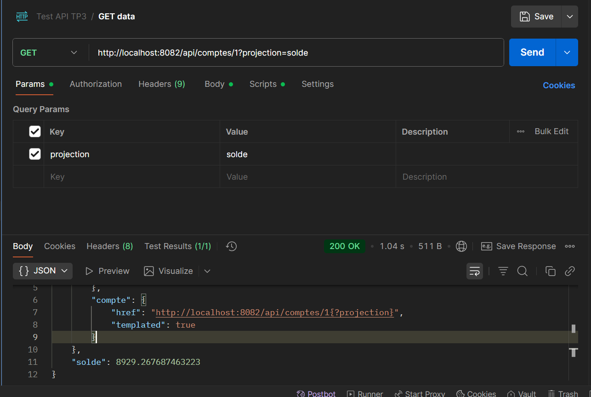
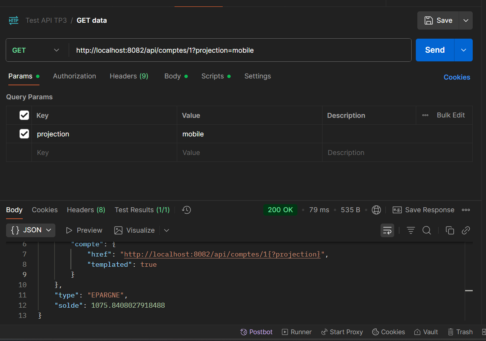
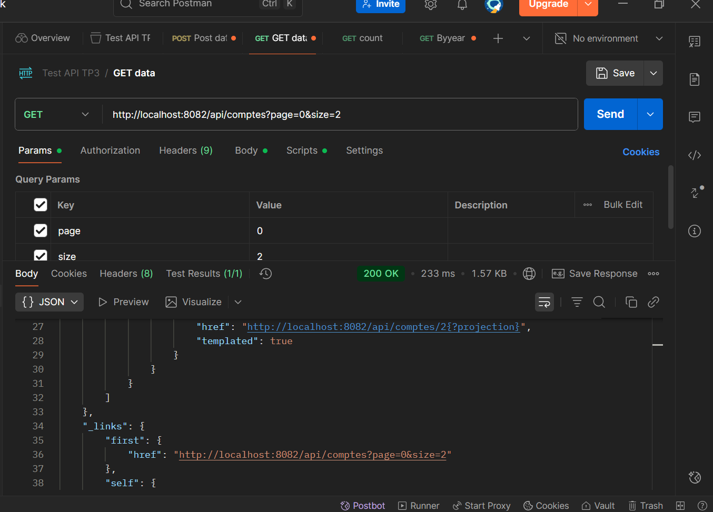
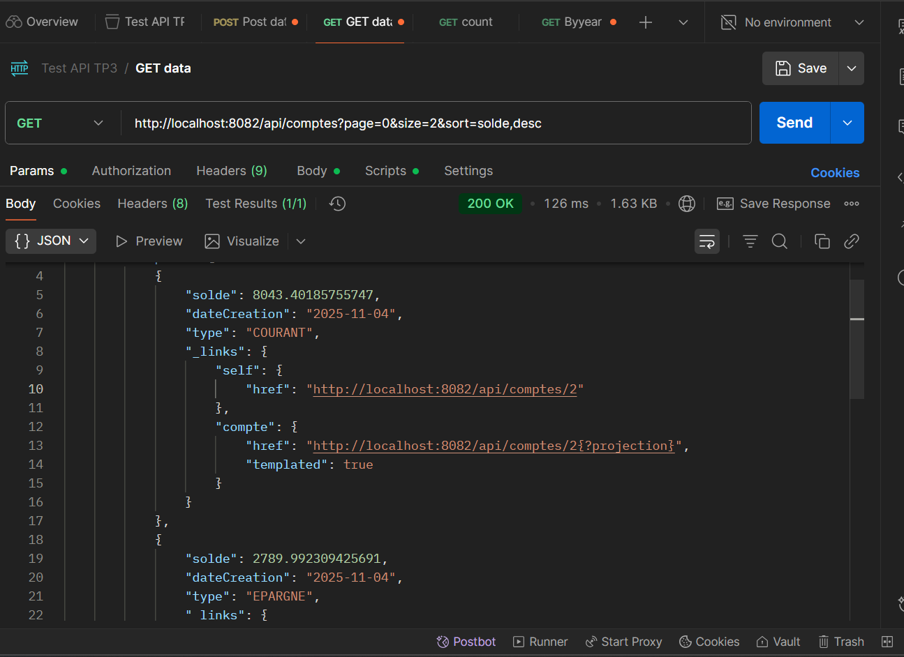
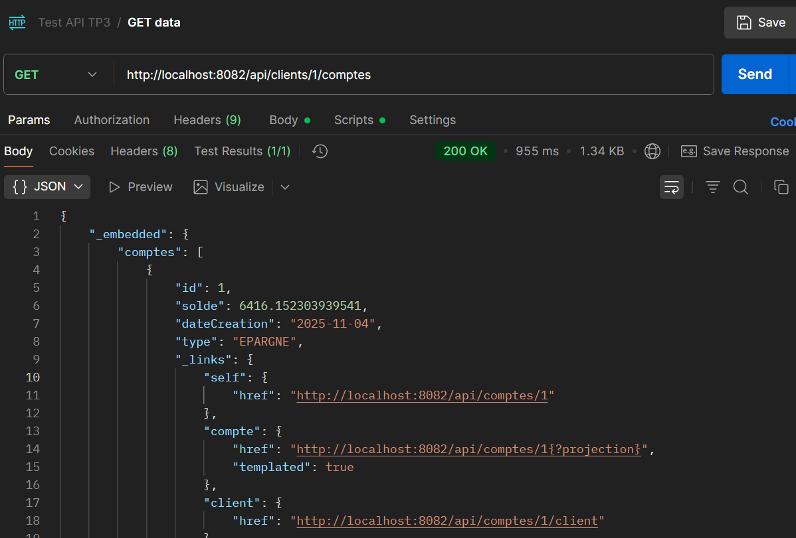
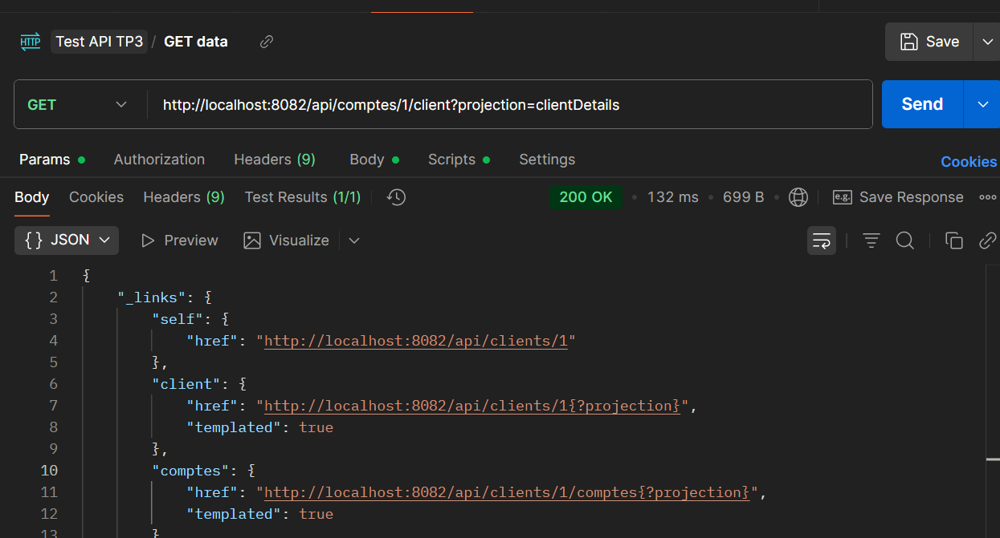
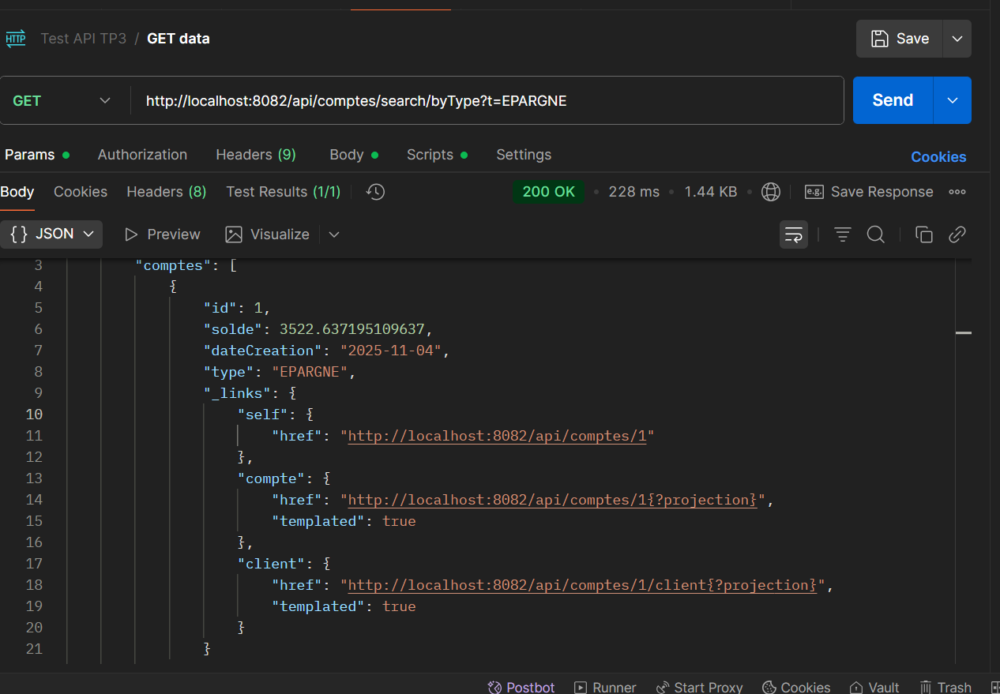

# TP_11_SpringDataREST

Affiche uniquement le solde du compte :

Affiche le solde et le type du compte : 

Affiche les comptes avec une pagination de 2 comptes par page :

Trie les comptes par solde en ordre décroissant :

Utilisateur avec l id : 

Affiche uniquement le nom et l'email du client associé au compte :

Personnalisé : 

